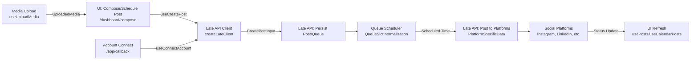

## Data Flow & Integrations

Data enters the system primarily through the frontend dashboard UI in a Next.js application. Users authenticate via API key validation (`src/app/api/validate-key/route.ts`), connect social media accounts through OAuth callbacks (`src/app/callback/page.tsx`), and compose posts with media uploads, scheduling, and queue management in dashboard pages like `/dashboard/compose`, `/dashboard/queue`, `/dashboard/calendar`, and `/dashboard/accounts`.

Once entered, data flows through React hooks that abstract interactions with the core backend service, the **Late API** (`src/lib/late-api`). Hooks such as `useAccounts`, `usePosts`, `useQueue`, and `useMedia` handle CRUD operations:

- Account connection and health checks persist account data (`Account`, `AccountHealth`) via Late API.
- Media uploads use presigned URLs (`useMediaPresign`, `useUploadMedia`) before attaching to posts (`MediaItem`).
- Posts (`PlatformPost`, `CreatePostInput`) are created, updated, or retried, then assigned to queues (`QueueSlot`, `QueueSchedule`).
- Queues manage scheduling (`useQueueSlots`, `useNextQueueSlot`), normalizing slots (`normalizeSlot`) and previewing timelines.

Data exits via Late API's platform-specific posting endpoints (`PlatformSpecificData` for TikTok, Instagram, etc.), which proxy to social platforms (Facebook, LinkedIn, Google Business, etc.). Status updates (e.g., posted, failed) flow back to the UI for display in calendars or post lists. All persistence and orchestration occur server-side in Late API; the frontend acts as a client layer with no local storage beyond Zustand stores (`auth-store.ts`, `app-store.ts`).

## Module Dependencies

- **src/app/dashboard/** → `src/hooks/*` (useAccounts, usePosts, useQueue, useMedia), `src/lib/*` (late-api, utils, timezones, avatar), `src/components/*` (shared, ui)
- **src/hooks/** → `src/lib/late-api/*` (client.ts, types.ts), `src/stores/*` (auth-store.ts, app-store.ts), `src/lib/utils.ts`
- **src/lib/late-api/** → external Late API (HTTP client via `createLateClient`, `getServerClient`)
- **src/app/api/** → `src/lib/late-api/client.ts` (e.g., validate-key route)
- **src/app/callback/** → `src/hooks/use-accounts.ts`, `src/lib/late-api/types.ts`
- **src/components/shared/** → `src/lib/utils.ts` (cn), `src/lib/avatar.ts`, `src/lib/timezones.ts`

## Service Layer

- [`useAccounts`](src/hooks/use-accounts.ts) - Manages account CRUD, health checks (`useAccountsHealth`), platform filtering (`useAccountsByPlatform`), connections (`useConnectAccount`).
- [`usePosts`](src/hooks/use-posts.ts) - Handles post lifecycle (`useCreatePost`, `useUpdatePost`, `useDeletePost`, `useRetryPost`), filtering (`PostFilters`), views (`useCalendarPosts`, `useScheduledPosts`).
- [`useQueue`](src/hooks/use-queue.ts) - Queue operations (`useCreateQueue`, `useUpdateQueueSlots`, `useToggleQueueActive`), slot management (`useQueueSlots`, `useNextQueueSlot`), formatting (`formatQueueSlot`).
- [`useMedia`](src/hooks/use-media.ts) - Media handling (`useUploadMedia`, `useMediaPresign`), validation (`getMediaType`, `isValidMediaType`).
- [`useLate`](src/hooks/use-late.ts) / [`createLateClient`](src/lib/late-api/client.ts) - Core Late API client factory and hook for authenticated requests.

## High-level Flow

The primary pipeline follows a reactive, hook-driven flow from UI input to platform posting:

1. **Input**: User composes post in `/dashboard/compose` (text, media, platforms, schedule).
2. **Processing**: Hooks validate/sanitize (timezones via `formatInTimezone`, media via `getMaxFileSize`), create post/queue via Late API.
3. **Persistence**: Late API stores post/queue data.
4. **Scheduling**: Queue slots trigger posting at `getSlotTime`.
5. **Output**: Late API posts to platforms, updates status.

See [architecture.md](./architecture.md) for component hierarchy.

## Internal Movement

Modules collaborate via React Context/Providers (`Providers.tsx`) and Zustand stores (`AuthState`, `AppState`) for global state (profiles via `useProfiles`, auth). Hooks use SWR-like optimistic updates and mutations (e.g., `useUpdatePost` refetches lists). No in-app queues, events, or RPC; all coordination is via Late API HTTP calls (`getServerClient` for server actions). Shared utilities (`cn`, `timezones.ts`) ensure consistent formatting across components.

## External Integrations

- **Late API** (`https://api.late.link` inferred from client):
  | Aspect | Details |
  |--------|---------|
  | **Purpose** | Account OAuth, post/queue CRUD, platform posting, health checks. |
  | **Authentication** | Bearer token via API key (`src/app/api/validate-key`), client factories (`createLateClient`). |
  | **Payload Shapes** | `CreatePostInput`, `UpdatePostInput`, `QueueSchedule`, `PlatformSpecificData` (e.g., `InstagramPlatformData`). |
  | **Retry Strategy** | Hook-level retries (`useRetryPost`); Late handles exponential backoff (assumed server-side). |

- **Social Platforms** (proxied via Late):
  | Platform | Data Type | Purpose |
  |----------|-----------|---------|
  | TikTok | `TikTokPlatformData` | Video posts |
  | Instagram/Facebook | `InstagramPlatformData`, `FacebookPlatformData` | Stories, feeds |
  | LinkedIn/Google Business | `LinkedInPlatformData`, `GoogleBusinessPlatformData` | Professional posts |
  | Others (Pinterest, Telegram, etc.) | Platform-specific | Scheduled multi-posting |

## Observability & Failure Modes

Client-side errors are captured in React Error Boundaries (`error-boundary.tsx`). Hooks expose loading/error states for UI feedback (e.g., `useAccounts` returns `isLoading`, `error`). Late API responses include status (e.g., `AccountHealth`); failed posts trigger retries (`useRetryPost`) or dead-letter via queue (inferred). Logs via browser console; no distributed tracing. Compensating actions: Delete failed media, revert queue slots on `useDeletePost`. Metrics unavailable client-side; monitor Late API dashboard for throughput.

## Related Resources

- [Architecture](./architecture.md)
